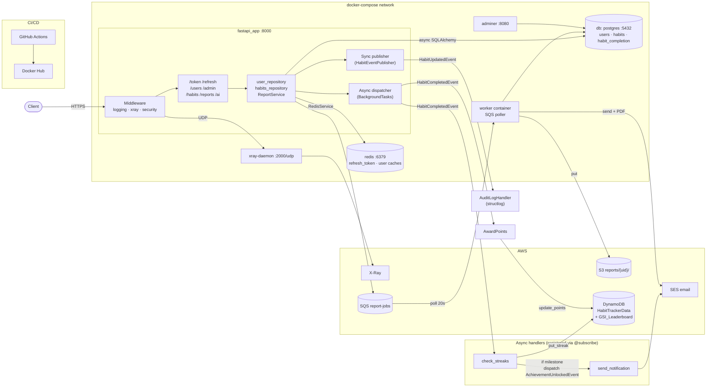

# Habit Tracker — Infrastructure Architecture

> **Status (2026-05-13):** sections describing **DynamoDB writes (streaks/points), the `HabitTrackerData` single-table layout, and `GSI_Leaderboard`** reflect a v0 in-code state being removed per AWS-deploy doc §15 Decision A v1.3 — that DDB code was write-only dead code with no read consumers. v1 deploy is Postgres-only; DDB returns in Week 11 with a **fresh schema for the AI Coach domain only**. Treat the affected diagrams below (lines ~60-67, ~113-129, ~159-186, ~207, ~254) as historical until this doc gets its v1 rewrite. See `learning-helper-claude-proj\project_ideas\habit-tracker-aws-deploy.md` §5 for the current data-layer split.

One-page view of the runtime: which container talks to which datastore, where AWS sits, how a request flows through middleware to the database and back, and how the event system fans out.

## Big picture — runtime

```
┌──────────────────────────────────────────────────────────────────────────────────────┐
│                       CLIENT  (browser / curl / mobile)                               │
│                  HTTPS → POST /api/v1/token, /habits, /refresh, ...                   │
└──────────────────────────────────────────┬───────────────────────────────────────────┘
                                           │
══════════════════════════════════════════ ▼ ════════════ docker-compose network ══════
║                                                                                      ║
║   ┌─────────────────────────────────────────────────────┐   ┌──────────────────┐    ║
║   │  fastapi_app   :8000     (src/api/main.py)          │   │ adminer  :8080   │    ║
║   │                                                      │   │ DB inspector     │    ║
║   │   ┌── Middleware chain ──────────────────────────┐  │   └────────┬─────────┘    ║
║   │   │ LoggingMiddleware   (bind request_id)        │  │            │              ║
║   │   │ XRayMiddleware      (begin_segment / capture)│──┼─── UDP ───►┐              ║
║   │   │ SecurityHeaders                              │  │            │              ║
║   │   └──────────────────┬───────────────────────────┘  │            ▼              ║
║   │                      ▼                               │   ┌─────────────────┐    ║
║   │   ┌── Routers  src/api/v1/routers/ ──────────────┐  │   │ xray-daemon     │    ║
║   │   │  /token  /refresh   (JWT auth + rotation)    │  │   │ :2000/udp       │    ║
║   │   │  /users  /admin                              │  │   └────────┬────────┘    ║
║   │   │  /habits  (CRUD + /complete)                 │  │            │             ║
║   │   │  /reports  /ai                               │  │            ▼             ║
║   │   └──────────────────┬───────────────────────────┘  │      AWS X-Ray cloud     ║
║   │                      ▼                               │                          ║
║   │   ┌── Repositories / services ──────────────────┐   │   ┌─────────────────┐    ║
║   │   │ user_repository.py    habits_repository     │───┼──►│ db (postgres)   │    ║
║   │   │ ReportService         AchievementService    │   │   │ :5432           │    ║
║   │   │                       (async SQLAlchemy)    │   │   │ users / habits/ │    ║
║   │   └──────────────────┬───────────────────────────┘  │   │ habit_completion│    ║
║   │                      │                               │   │  + Alembic      │    ║
║   │                      ├── RedisService ──────────────┼──►├─────────────────┤    ║
║   │                      │                               │   │ redis :6379     │    ║
║   │                      │                               │   │ refresh_token:{u}│   ║
║   │                      │                               │   │ user:{id}:habits│    ║
║   │                      │                               │   │ user:{id}:profile│   ║
║   │                      │                               │   └─────────────────┘    ║
║   │                      ▼                                                          ║
║   │   ┌── Event paths ──────────────────────────────────────────────────────────┐  ║
║   │   │                                                                          │  ║
║   │   │  (A) Async dispatcher  src/core/events/dispatcher.py                     │  ║
║   │   │      router → BackgroundTasks → dispatch(HabitCompletedEvent, ctx)       │  ║
║   │   │        ├─► check_streaks   ── put_streak ──────┐                         │  ║
║   │   │        └─► (if milestone) dispatch(AchievementUnlockedEvent)             │  ║
║   │   │              └─► send_notification ──────────────────► AWS SES           │  ║
║   │   │                                                  │                       │  ║
║   │   │  (B) Sync publisher  src/core/events/publisher.py                        │  ║
║   │   │      service → publisher.publish(HabitUpdatedEvent)                      │  ║
║   │   │        └─► AuditLogHandler.handle  ── structlog ─► JSON logs             │  ║
║   │   └──────────────────────────────────────────────────┼───────────────────────┘  ║
║   └──────────────────────────────────────────────────────┼──────────────────────────┘
║                                                          │
║                                                          ▼
║                          ┌───────────────────────────────────────────┐
║                          │  AWS DynamoDB  (single-table)             │
║                          │  table: HabitTrackerData                  │
║                          │  PK = USER#{user_id}                      │
║                          │  SK = METADATA          → TotalPoints     │
║                          │  SK = STREAK#{habit_id} → StreakCount     │
║                          │  SK = ACHIEVEMENT#{type}                  │
║                          │  GSI_Leaderboard (EntityType, TotalPoints)│
║                          └───────────────────────────────────────────┘
║                                                                                      ║
║   ┌── Report pipeline (separate path) ───────────────────────────────────────┐      ║
║   │  router/event ─► AWS SQS report-jobs                                     │      ║
║   │                          │ poll 20s                                      │      ║
║   │                          ▼                                               │      ║
║   │  worker container   src/infrastructure/aws/worker.py                     │      ║
║   │   1. ReceiveMessage (≤10)                                                │      ║
║   │   2. ReportService.build  ─── async SQLAlchemy ────► db (postgres)       │      ║
║   │   3. PDFGenerator (HTML → PDF)                                           │      ║
║   │   4. S3Client.put ─────────────────────────────────► AWS S3              │      ║
║   │   5. SESClient.send (PDF attachment) ──────────────► AWS SES             │      ║
║   │   6. DeleteMessage                                                       │      ║
║   └───────────────────────────────────────────────────────────────────────────┘      ║
║                                                                                      ║
═══════════════════════════════════════════════════════════════════════════════════════

       File logs (JSON)              GitHub Actions  ─ fmt/lint/pytest/Trivy ─►  Docker Hub
       logs/app_YYYYMMDD.log         .github/workflows/ci.yml                   wojslaw/habit-tracker
       (structlog, daily rotate)
```

## Zoom-in — login flow (`POST /api/v1/token`)

```
Client          FastAPI router       user_repo       Postgres    Redis     X-Ray
  │ creds         │                     │               │          │         │
  ├──────────────►│                     │               │          │         │
  │               │ begin_segment ──────┼───────────────┼──────────┼────────►│
  │               │ authenticate_user   │               │          │         │
  │               ├────────────────────►│ SELECT user   │          │         │
  │               │                     ├──────────────►│          │         │
  │               │                     │◄──────────────┤          │         │
  │               │◄────────────────────┤ verify hash   │          │         │
  │               │ JWT.encode access (30 min, HS256)   │          │         │
  │               │ JWT.encode refresh (7 d, jti=uuid)  │          │         │
  │               │ SET refresh_token:{username} = jti ─┼─────────►│         │
  │ access+refresh│                     │               │          │         │
  │◄──────────────┤                     │               │          │         │
```

On `POST /refresh`, the stored `jti` in Redis is compared to the token's `jti`; on mismatch the Redis key is deleted and the request is rejected (refresh-token rotation / replay protection).

## Zoom-in — habit completion + event fan-out (`POST /habits/{id}/complete`)

```
Client      router       habits_repo    Postgres   BackgroundTasks   handlers (async)        DynamoDB    SES
  │  POST     │              │             │             │                  │                   │         │
  ├──────────►│ insert       │             │             │                  │                   │         │
  │           ├─────────────►│ INSERT      │             │                  │                   │         │
  │           │              ├────────────►│             │                  │                   │         │
  │           │              │◄────────────┤             │                  │                   │         │
  │           │ add_task(dispatch(HabitCompletedEvent, ctx))─►              │                   │         │
  │  202/200  │              │             │             │                  │                   │         │
  │◄──────────┤              │             │             │                  │                   │         │
                                                         │                  │                   │         │
                                                         │ check_streaks    │                   │         │
                                                         ├─────────────────►│ get_completions   │         │
                                                         │                  ├──► Postgres        │         │
                                                         │                  │ put_streak ──────►│         │
                                                         │                  │ if milestone:     │         │
                                                         │                  │   dispatch(AchievementUnlockedEvent)
                                                         │                  │     └► send_notification ──┼────►│
```

`Context` (`src/core/events/handlers.py:27-33`) carries `user_repo`, `habit_repo`, and `ses_client`, built in `src/api/v1/routers/dependencies.py:get_events_context`. Streaks are derived from Postgres completions via `src/core/streak_service.py` — no DynamoDB write path in v1 (see AWS deploy doc Decision A v1.3 for the dead-code removal rationale).

## Two event systems (yes, both exist)

| | (A) Async dispatcher | (B) Sync publisher |
|-|-|-|
| File | `src/core/events/dispatcher.py` + `handlers.py` | `src/core/events/publisher.py` |
| Registration | `@subscribe(EventType)` decorator → global `event_registry` | `publisher.register(handler)` (per-instance registry) |
| Invocation | `await dispatch(event, ctx)` — async, awaits each handler | `publisher.publish(event)` — sync, calls `.handle()` |
| Events | `HabitCompletedEvent`, `AchievementUnlockedEvent` | `HabitUpdatedEvent` |
| Handlers | `check_streaks`, `send_notification` | `AuditLogHandler` |
| Side effects | DynamoDB writes, SES email, may chain-dispatch | structlog audit line per field change |
| Triggered from | `POST /habits/{id}/complete` via `BackgroundTasks` | `src/core/habit_async.py` on habit field updates |

## Datastore responsibility split

| Store | Purpose | Code |
|-|-|-|
| Postgres `users` / `habits` / `habit_completion` | Authoritative source of truth: identity, habit definitions, completion log, derived streaks | `src/repository/*.py`, `src/core/models.py`, `src/core/streak_service.py` |
| Redis | Refresh-token JTIs, hot-path read caches (habits per user, profile) | `src/core/cache.py` |
| DynamoDB (deferred to v2) | AI Coach chat history + coach state — Week 11 introduction with fresh single-table schema for the AI domain only (see AWS deploy doc §5) | — (not in v1) |
| S3 | Generated weekly-report PDFs at `reports/{user_id}/weekly_w{week}.pdf` | `src/infrastructure/aws/s3_client.py` |
| SQS `report-jobs` | Async report-generation queue between API and worker | `src/infrastructure/aws/queue_client.py` |
| SES | Outbound email: weekly reports, achievement congrats | `src/infrastructure/aws/email_client.py` |
| X-Ray | Distributed tracing, request segments + boto3 subsegments | `src/api/middleware.py` |
| File logs | Structured JSON logs, daily rotation | `src/utils/logger.py` → `logs/app_YYYYMMDD.log` |

## DynamoDB single-table layout

```
table: HabitTrackerData               (CFN: src/infrastructure/aws/data/dynamodb_table.yml)

PK                  SK                       attributes              meaning
─────────────────── ──────────────────────── ─────────────────────── ─────────────────────────
USER#{user_id}      METADATA                 TotalPoints, EntityType user-level rollup
USER#{user_id}      STREAK#{habit_id}        StreakCount             one item per habit
USER#{user_id}      ACHIEVEMENT#{type}       unlocked_at, …          one item per achievement

GSI_Leaderboard:    HASH=EntityType, RANGE=TotalPoints      → "top N users" query
```

A single `Query(PK="USER#{id}")` returns metadata + all streaks + all achievements in one call (no joins, single-table design).

## Mermaid version (renders in GitHub / VS Code)



## Service map

| Component       | Container                | Port      | Code / config |
|-----------------|--------------------------|-----------|---------------|
| API             | `fastapi_app`            | 8000      | `src/api/main.py`, `src/api/v1/routers/*` |
| Auth            | (in API)                 | —         | `src/api/v1/routers/security.py`, `src/core/security.py` |
| Postgres        | `db`                     | 5432      | `src/core/db.py`, `src/core/models.py`, `alembic/` |
| Redis           | `redis`                  | 6379      | `src/core/cache.py` |
| X-Ray daemon    | `xray-daemon`            | 2000/udp  | `src/api/middleware.py` |
| DynamoDB        | AWS (cloud)              | —         | `src/infrastructure/aws/dynamodb_client.py`, `data/dynamodb_table.yml`, `DYNAMODB_DESIGN.md` |
| SQS / S3 / SES  | AWS (cloud)              | —         | `src/infrastructure/aws/{queue_client,s3_client,email_client}.py` |
| Worker          | `worker`                 | —         | `src/infrastructure/aws/worker.py` |
| Async events    | (in API)                 | —         | `src/core/events/{dispatcher,handlers,events}.py` |
| Sync events     | (in API)                 | —         | `src/core/events/publisher.py` + `AuditLogHandler` in `handlers.py` |
| DB UI           | `adminer`                | 8080      | — |
| Logs            | host volume              | —         | `src/utils/logger.py` → `logs/app_YYYYMMDD.log` |
| CI              | GitHub Actions           | —         | `.github/workflows/ci.yml` |
| Compose / image | —                        | —         | `docker-compose.yaml`, `Dockerfile` |

## Auth lifecycle in two lines

- **Login** `POST /api/v1/token` → verify password against Postgres `users` → mint access (30 min) + refresh (7 d, with `jti`) → cache `refresh_token:{username} = jti` in Redis.
- **Refresh** `POST /api/v1/refresh` → decode refresh token → compare its `jti` to Redis copy → on match, mint new pair and replace cached `jti`; on mismatch, delete the key and reject (replay/rotation protection).

## Async / event paths

- **Habit completed** → `POST /habits/{id}/complete` writes the completion to Postgres and returns immediately; `dispatch(HabitCompletedEvent, ctx)` is enqueued via FastAPI `BackgroundTasks`. The async dispatcher runs `check_streaks` (writes new streak to DynamoDB, may chain-dispatch `AchievementUnlockedEvent`). An `AchievementUnlockedEvent` triggers `send_notification`, which emails the user via SES. Point calculation is now a pure read-path helper in `src/core/streak_service.py` (`compute_completion_points`) — no longer persisted via an event handler.
- **Habit updated** → service layer publishes `HabitUpdatedEvent` synchronously through `HabitEventPublisher`; `AuditLogHandler` writes one structlog line per changed field.
- **Weekly report** → enqueued to SQS → `worker` container builds stats from Postgres, renders HTML → PDF, uploads to `s3://…/reports/{user_id}/weekly_w{week}.pdf`, emails via SES with the PDF attached, then deletes the SQS message.

## Observability summary

- **Structured logs** — `structlog`, dual-rendered: colored to console + JSON to `logs/app_YYYYMMDD.log` (daily rotation). `request_id` is bound per request in `LoggingMiddleware`.
- **Distributed tracing** — `XRayMiddleware` opens a segment per request (method, path, status, exceptions); `boto3` + `requests` are patched so downstream AWS calls (Postgres-via-boto3 not applicable, but DynamoDB / SQS / S3 / SES) show up as subsegments.
- **Health** — `GET /health` checks Postgres connectivity.
